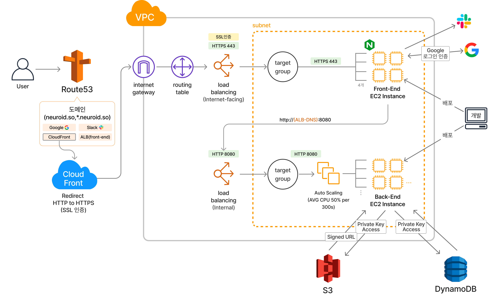

# Neuroid — 3D Motion Generation Backend

> Production backend for a text-to-3D-motion AI generation service  
> Built at [NationA](https://nationa.ai) · Sep 2023 – Mar 2024  
> 📈 Reached **1 million global users within 1 month** of launch  

---

## 🧩 What is Neuroid?
Neuroid is the world's first AI platform that generates 3D/4D human 
motion data from text input — used for real-time character animation 
in games and virtual environments (Roblox, FBX, GLB formats).

---

## 🏗️ Architecture Overview

### Phase 1 — EC2-based (Sep 2023 ~ early 2024)



Initial production infrastructure on AWS EC2:

**Request flow**  
`User` → `Route 53` → `CloudFront (SSL)` → `Internet-facing ALB`  
→ `Front-End EC2 × 4 (Nginx)` → `Internal ALB (HTTP 8080)`  
→ `Auto-scaling Back-End EC2 (Flask · CPU threshold 50%)`

**AI processing pipeline (inside Back-End EC2)**  
`Text input` → `VQ-VAE + Transformer` → `BVH motion data`  
→ `Blender rigging` → `FBX / GLB output` → `S3`

| Component | Detail |
|---|---|
| Compute | EC2 Auto Scaling (avg CPU 50% / 300s) |
| Proxy | Nginx on 4 Front-End EC2 instances |
| Auth | Google OAuth 2.0 |
| DB | DynamoDB + SQLite + S3 |
| Alerts | Slack Webhook |

---

### Phase 2 — Frontend serverless migration (2024 ~)



Frontend server (Nginx EC2 × 4) replaced with CloudFront + S3 
static hosting. Backend EC2 infrastructure remained unchanged.

**Frontend (migrated)**  
`User` → `Route 53` → `CloudFront (CDN · SSL)` → `S3 (static files)`

**Backend API (unchanged)**  
`User` → `Route 53` → `Internet-facing ALB`  
→ `Auto-scaling Back-End EC2 (Flask · AI pipeline · CPU 50%)`  
→ `DynamoDB / S3 / SQLite`

| Component | Phase 1 | Phase 2 |
|---|---|---|
| Frontend | Nginx on EC2 × 4 | CloudFront + S3 |
| Backend | Auto-scaling EC2 | Auto-scaling EC2 (unchanged) |
| FE server management | Required | None |
| FE infra cost | Fixed (always-on) | Pay-per-use |
| Backend | Same | Same |

**Why we migrated the frontend**  
The Nginx-based FE EC2 tier was stateless — serving only 
static files. Replacing it with CloudFront + S3 eliminated 
4 always-on EC2 instances, reduced latency via CDN edge nodes, 
and removed frontend server management entirely.  
The backend was kept on EC2 due to heavy AI inference workloads 
(VQ-VAE + Transformer) that require consistent compute resources.

## ⚙️ Tech Stack

| Layer | Technology |
|---|---|
| Language | Python |
| Web framework | Flask |
| DNS & CDN | AWS Route 53 + CloudFront |
| Load balancing | AWS ALB (internet-facing + internal) |
| Compute | AWS EC2 (Auto Scaling, CPU 50% threshold) |
| Proxy | Nginx (4 front-end instances) |
| AI model | VQ-VAE + Transformer (nationatext v2/v3) |
| 3D pipeline | Blender + BVH rigging scripts |
| Storage | AWS S3 (static + dynamic assets) |
| Database | DynamoDB (user data) + SQLite (search index) |
| Auth | Google OAuth 2.0 |
| Alerts | Slack Webhook |

---

## 🔑 Key Design Decisions

**Two-tier EC2 with separate ALBs**  
Internet-facing ALB handles public HTTPS traffic and SSL termination.  
Internal ALB routes traffic to back-end on HTTP 8080, keeping 
the compute layer fully private within the VPC subnet.

**Auto Scaling on CPU threshold**  
Back-end EC2 scales automatically when average CPU exceeds 50% 
over 300 seconds — critical for handling AI inference spikes 
without manual intervention.

**Hybrid database strategy**  
SQLite handles search-heavy queries (fast local lookups by ID/type).  
DynamoDB stores user history data accessible only by email (PK).  
S3 stores both static assets (`nationa-roblox`) and user-generated 
dynamic assets (`neublox-asset`), synced across all instances daily.

**AI motion generation pipeline**  
Text input is processed by a VQ-VAE + Transformer model to generate 
human motion sequences, then converted to BVH format and rigged onto 
3D characters via Blender scripts for FBX/GLB export.

---

## 📈 Impact

- Platform reached **1 million global users within 1 month** of launch
- ~50% of users were US-based at launch
- Handled AI inference load via CPU-based auto scaling
- Supported Roblox, FBX, and GLB output formats

---

## 📂 Project Structure
neuroid-backend/
├── main.py                      # Server entrypoint
├── main.sh                      # Shell script to start server
├── constant.py                  # Constants
├── apis/                        # External service clients
│   ├── dynamoDB.py
│   ├── s3.py
│   ├── sqlite3.py
│   ├── emailProcess.py
│   └── utils.py
├── domain/                      # Business logic layer
│   ├── user.py
│   ├── auth.py
│   ├── avatar.py
│   ├── content.py
│   ├── project.py
│   └── ...
├── nationatext_ver2/            # AI motion generation v2 (VQ-VAE + Transformer)
│   ├── models/                  # Model architecture
│   │   ├── vqvae.py
│   │   ├── t2m_trans.py
│   │   └── ...
│   └── pretrained/              # Pretrained weights
├── nationatext_ver3/            # AI motion generation v3 (MLD + HumanML3D)
│   ├── mld/                     # Motion Latent Diffusion model
│   ├── configs/
│   └── ...
├── generate_script/             # 3D character generation (Blender)
│   ├── generate_faceandbody.py
│   └── generate_customed_character.py
├── fbxout/                      # Motion output files
│   ├── generated/               # FBX / GLB output
│   └── roblox/                  # Roblox rigging scripts (BVH pipeline)
└── human-generator/             # Human character asset generator (Blender)
├── generator.py
├── export_character.py
└── ...

---

## 🔧 Environment Variables

```env
AWS_REGION=
S3_BUCKET_STATIC=
S3_BUCKET_DYNAMIC=
DYNAMODB_TABLE=
SLACK_WEBHOOK_URL=
GOOGLE_CLIENT_ID=
```

---

> 📌 Source code is proprietary. This repository contains  
> architecture documentation only.